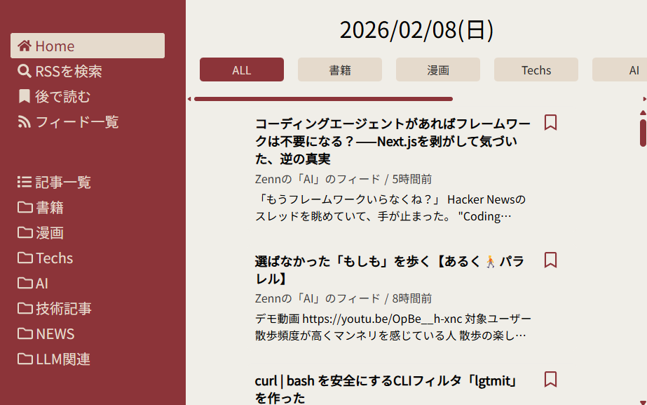
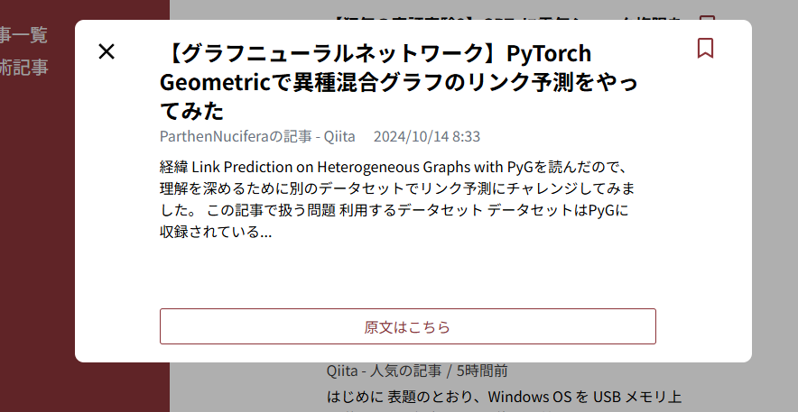
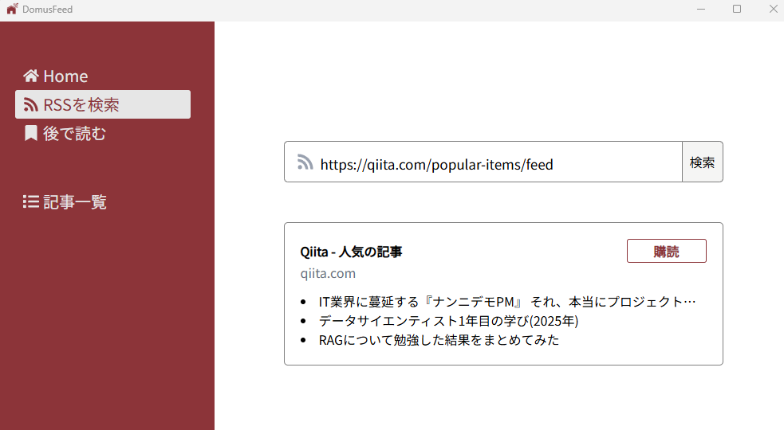

# Domus Feed
Domus FeedはデスクトップPC向けのRSSフィードリーダーアプリです。
クラウドサービスを利用せず、アプリケーションデータはユーザーのローカル環境に保存されます。

Domus Feed is a desktop RSS reader application. Application data is stored on the user's local environment without using cloud services.

※スクリーンショットでは開発者本人が執筆したQiita記事を例として表示しています。

## RSSの検索と登録
RSSフィードのURLを入力すると内容をプレビューしてからフィードの登録ができます。

  
※スクリーンショットではQiitaの公開RSSフィードを例として使用しています。

## 基本機能の紹介
- **記事の一覧表示**  
Home画面では当日に取得した記事を一覧で確認できます。
また、記事一覧画面では過去に取得した記事も確認できます。

- **記事の詳細表示**  
記事をクリックすると、記事の詳細（RSSのsummary）を表示します。

- **記事のブックマーク**  
ブックマークした記事は「後で読む」画面からまとめて確認できます。

- **原文ページへの遷移**  
記事の詳細画面の「原文はこちら」ボタンから、元の記事ページを既定のブラウザで開けます。

- **フィード検索・登録**  
RSS検索画面にてフィードのURLを入力して検索するとフィードのプレビューができます。
さらに、購読ボタンを押すとプレビューしたフィードを登録できます。

- **フォルダへの振り分け**  
フィードはフォルダに分類し、フォルダ単位で記事を表示できます。

## 仕様
- 登録したRSSフィードから過去14日分の記事を取得します
- ブックマークしていない記事は、取得後7日まで表示されます
- ブックマークしている記事は取得日に関わらず表示されます

## Download
最新のインストーラーは[GitHub Releases](xxxx)ページからダウンロードできます。

## セキュリティに関する注意
### 通信について
本アプリケーションはローカルホスト（`127.0.0.1`）上でのみで動作します。  
ユーザーが登録したRSSフィード取得する際に限り、該当WebサイトへのHTTPリクエストを送信しますが、それ以外の用途でユーザーの情報を外部へ送信することはありません。

### セキュリティレポート
Virus TotalおよびCargo Auditでチェックを実施しています。  
詳細なレポートは[security/report.md](security/report.md)をご覧ください。

## ライセンス
All rights reserved.

本リポジトリに含まれる成果物の再配布、改変、解析などは許可していません。

## サポート
インストールや実行時の問題については本リポジトリの[GitHub Issues](https://github.com/kitataku/domus-feed-releases/issues)よりご連絡ください。

